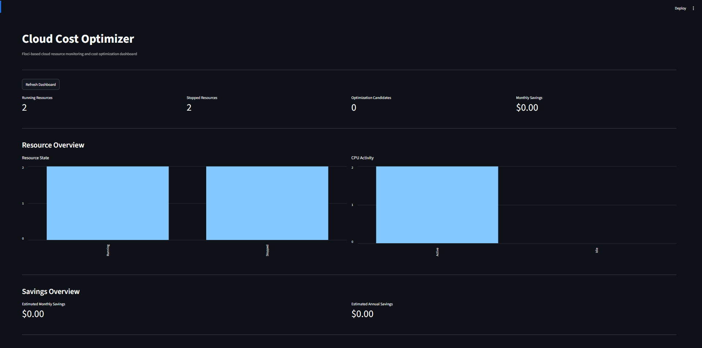
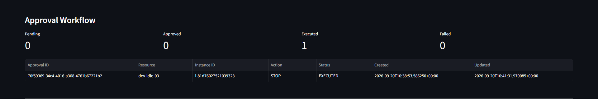
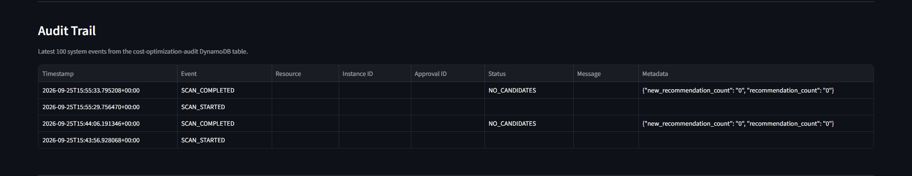
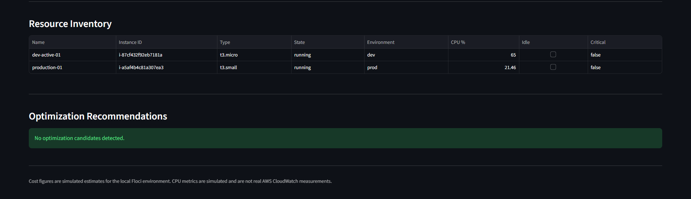
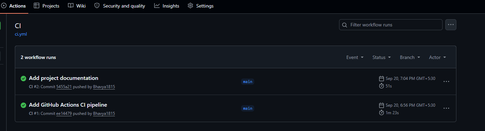

# Cloud Cost Optimization Bot

A Dockerized cloud cost optimization platform that discovers running compute resources, identifies idle non-production resources, estimates potential savings, creates approval requests, and executes approved remediation through a Telegram control bot.

> Local implementation: the project is developed and tested with Floci, an AWS-compatible local emulator. Cost figures and CPU metrics in the local demo are simulated values. The codebase includes provider abstractions for future AWS CloudWatch and Cost Explorer integration.

## What It Does

The platform evaluates compute resources and identifies candidates for cost optimization.

1. Discover running EC2 resources.
2. Evaluate CPU utilization.
3. Identify idle non-production resources.
4. Apply safety rules and optimization tags.
5. Estimate potential monthly savings.
6. Store recommendations in DynamoDB.
7. Create explicit approval requests.
8. Send recommendations to Telegram.
9. Require human approval before remediation.
10. Re-check the resource before execution.
11. Stop the approved resource when safety checks pass.
12. Record the workflow in an audit trail.
13. Display operational state through the Streamlit dashboard.

No resource is stopped by the monitoring scan alone.

## Architecture

```text
Floci
  |
  v
Python + boto3
  |
  +--> Resource Scanner
  |
  +--> CPU / Idle Detection
  |
  +--> Cost Engine
  |
  v
Analyzer
  |
  +--> DynamoDB Recommendations
  |
  +--> DynamoDB Approvals
  |
  +--> DynamoDB Audit Trail
  |
  +--> Telegram Alerts
  |
  +--> Streamlit Dashboard
  |
  v
Explicit Human Approval
  |
  v
Safety Re-check
  |
  v
Approved Remediation
```

## Dashboard

The Streamlit dashboard provides resource state, CPU activity, estimated savings, approval status, resource inventory, optimization recommendations, and audit history.



### Approval Workflow

Recommendations create approval requests instead of immediately stopping resources.



### Audit Trail

Operational and security-sensitive events are recorded in DynamoDB and displayed in the dashboard.



### Resource Optimization

The dashboard displays optimization candidates, CPU utilization, recommended actions, and estimated savings.



## GitHub Actions CI

GitHub Actions automatically:

- installs dependencies
- runs the test suite
- validates Docker Compose
- builds the Docker image



## Key Features

### Resource Discovery

Discovers EC2 instances through boto3 and extracts:

- Instance ID
- Instance type
- Running state
- Name
- Environment
- Criticality
- Cost-optimization tag

### Idle Resource Detection

The local demo uses a simulated metrics provider so the application can run without a real AWS account.

The provider architecture also supports future AWS CloudWatch integration.

### Cost Estimation

The local environment uses simulated EC2 hourly rates to estimate potential monthly savings.

Example rates:

| Instance Type | Hourly Rate |
|---|---:|
| `t2.micro` | `$0.0116` |
| `t3.micro` | `$0.0104` |
| `t3.small` | `$0.0208` |
| `t3.medium` | `$0.0416` |
| `m5.large` | `$0.0960` |

These are demonstration estimates for the local Floci environment and are not live AWS billing data.

### Approval Workflow

Every new optimization recommendation creates an approval request.

Telegram commands:

```text
/start
/approve <approval_id>
/reject <approval_id>
/status <approval_id>
```

Remediation is not executed until an authorized Telegram user explicitly approves the request.

### Safety Controls

Remediation is blocked when:

- the instance is not running
- the environment is production
- the instance is marked critical
- cost optimization is disabled
- the resource is not idle

The resource is scanned again immediately before remediation.

### Audit Trail

Supported audit event types include:

```text
SCAN_STARTED
SCAN_COMPLETED
SCAN_FAILED
RECOMMENDATION_DETECTED
APPROVAL_CREATED
APPROVAL_APPROVED
APPROVAL_REJECTED
ALERT_SENT
UNAUTHORIZED_COMMAND
REMEDIATION_REQUESTED
REMEDIATION_BLOCKED
REMEDIATION_EXECUTED
REMEDIATION_FAILED
```

### Duplicate Alert Prevention

Recommendations are persisted in DynamoDB.

An existing recommendation does not create a new approval request on every monitoring scan.

### Structured Logging

Application services use structured logging with timestamps, severity, logger name, and event messages.

### Dockerized Services

| Service | Purpose | Port |
|---|---|---:|
| `floci` | Local AWS-compatible emulator | `4566` |
| `dashboard` | Streamlit monitoring dashboard | `8501` |
| `scheduler` | Periodic monitoring and reporting | - |
| `telegram-bot` | Telegram approval/control interface | - |

## Project Structure

```text
cloud-cost-optimizer/
├── app/
│   ├── approval.py
│   ├── approval_store.py
│   ├── audit.py
│   ├── audit_store.py
│   ├── aws_client.py
│   ├── config.py
│   ├── config_validation.py
│   ├── cost_engine.py
│   ├── dashboard.py
│   ├── dynamodb_store.py
│   ├── idle_detector.py
│   ├── logging_config.py
│   ├── main.py
│   ├── remediation.py
│   ├── remediation_service.py
│   ├── report_generator.py
│   ├── scanner.py
│   ├── scheduler.py
│   ├── telegram_bot.py
│   ├── telegram_formatter.py
│   ├── telegram_notifier.py
│   └── providers/
│       ├── metrics.py
│       └── pricing.py
├── docs/
│   └── images/
│       ├── 01-dashboard-overview.png
│       ├── 02-approval-workflow.png
│       ├── 03-audit-trail.png
│       ├── 04-resource-optimization.png
│       └── 05-github-actions-ci.png
├── tests/
│   ├── test_audit.py
│   ├── test_providers.py
│   └── test_security.py
├── .github/
│   └── workflows/
│       └── ci.yml
├── .dockerignore
├── .gitignore
├── AWS-MIGRATION.md
├── Dockerfile
├── docker-compose.yml
├── requirements.txt
└── requirements-dev.txt
```

## Running Locally

### Prerequisites

- Windows 10/11
- Docker Desktop
- WSL2
- Python 3.13+
- Git

### Start the stack

```powershell
docker compose up -d
```

Check services:

```powershell
docker compose ps
```

### Dashboard

```text
http://localhost:8501
```

### Floci

```text
http://localhost:4566
```

### Floci UI

```text
http://localhost:4500
```

## Environment Variables

Example local configuration:

```powershell
$env:AWS_ENDPOINT_URL="http://localhost:4566"
$env:AWS_ACCESS_KEY_ID="test"
$env:AWS_SECRET_ACCESS_KEY="test"
$env:AWS_REGION="us-east-1"

$env:TELEGRAM_BOT_TOKEN="your-bot-token"
$env:TELEGRAM_CHAT_ID="your-chat-id"

$env:METRICS_PROVIDER="simulated"
$env:PRICING_PROVIDER="simulated"
$env:LOG_LEVEL="INFO"
```

Do not commit Telegram credentials or other secrets.

## Testing

The automated test suite covers:

- simulated metrics
- simulated pricing
- idle detection
- audit events
- security and remediation controls

Current test suite:

```text
37 passed
```

Run the tests:

```powershell
python -m pytest -q
```

## CI/CD

GitHub Actions validates the project on pushes and pull requests to `main`.

The pipeline performs:

```text
Checkout
   |
   v
Python 3.13
   |
   v
Install dependencies
   |
   v
Run pytest
   |
   v
Validate Docker Compose
   |
   v
Build Docker image
```

Workflow:

```text
.github/workflows/ci.yml
```

## AWS Migration Path

The local implementation separates cloud-specific providers from the application logic.

Current local configuration:

```text
METRICS_PROVIDER=simulated
PRICING_PROVIDER=simulated
```

Future AWS providers:

```text
METRICS_PROVIDER=cloudwatch
PRICING_PROVIDER=cost_explorer
```

Migration details are documented in:

```text
AWS-MIGRATION.md
```

The project is demonstrated locally today while keeping a clear path toward real AWS services.

## Technical Stack

- Python 3.13
- boto3
- Floci
- DynamoDB
- Docker
- Docker Compose
- Streamlit
- Telegram Bot API
- APScheduler
- pytest
- GitHub Actions
- Git

## Security Design

The remediation workflow intentionally requires explicit human approval.

Additional controls include:

- Telegram chat authorization
- production-resource protection
- critical-resource protection
- cost-optimization tag enforcement
- idle-state validation
- resource re-check before remediation
- unauthorized command auditing
- remediation audit events
- environment-based secret configuration
- non-root Docker application user

## End-to-End Workflow

```text
Discover
   |
   v
Analyze
   |
   v
Estimate
   |
   v
Recommend
   |
   v
Request Approval
   |
   v
Human Decision
   |
   v
Re-check Resource
   |
   v
Remediate
   |
   v
Audit
   |
   v
Visualize
```

## Project Outcome

This project demonstrates a complete cloud-automation workflow covering:

- cloud resource discovery
- monitoring
- idle-resource detection
- cost optimization
- approval-based remediation
- DynamoDB persistence
- Telegram automation
- dashboard visualization
- audit logging
- Dockerization
- automated testing
- CI/CD

The current implementation is a local Floci-based demonstration. It does not claim to represent live AWS billing or production AWS infrastructure.

## Author

**Bhavyarajsinh Raulji**

GitHub:
https://github.com/Bhavya1815

Portfolio:
https://bhavyarajsinh.vercel.app

Repository:
https://github.com/Bhavya1815/cloud-cost-optimization-bot